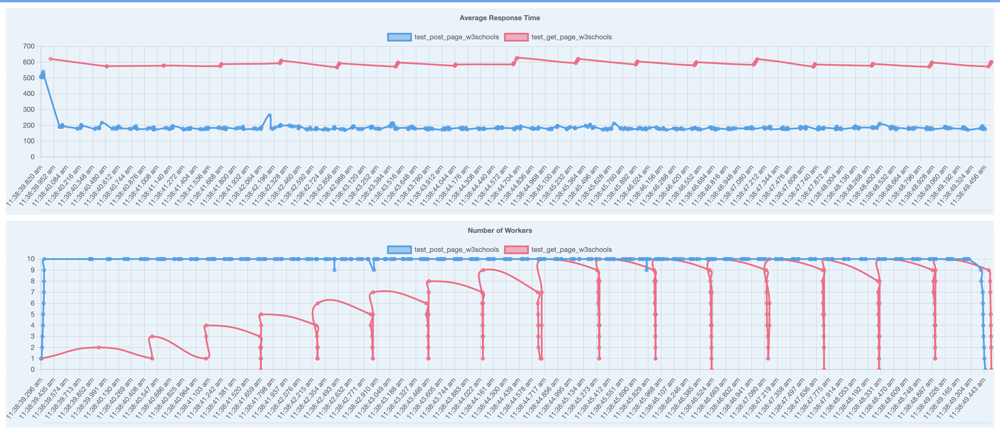

# MAGO

## What is MAGO?

MAGO is an open-source framework purely in python for QA engineers to perform any tests that is related to the performance, stress, and load tests. The purpose of MAGO framework is to bring insights and visibility to these complicated tests.

## How to install MAGO?

To install MAGO, all you have to do is

    pip install mago

To know where the package is located under PyPI, please follow this [link](https://pypi.org/project/mago/).

## MAGO Features

Once MAGO is installed on your machine, it's really easy to use. The main purpose of MAGO is designed for QA developers to easily use the framework and be able to run simple to most complicated tests. Just a reminder that MAGO is not designed to use for tests that are categorized as functional and regression tests. Let's check out some examples below to how to use some basic MAGO framework.

```python
from mago.mago import Mago
```

As mentioned above, MAGO can be easily called using the package above. Once this line has been implemented, let's try some simple sleep tests. We will have two functions.

```python
    #sleep random between 1 second to 4 seconds
    def random_sleep():
    time.sleep(random.randrange(1,4))

    #sleep for 2 seconds
    def sleep_2_seconds():
        time.sleep(2)

    #sleep for 4 seconds
    def sleep_4_seconds():
        time.sleep(4)
```

Then we can pass these functions to the workers in MAGO. MAGO will have default of 10 workers per task. Let's just quickly see the example and I'll explain next of what's going on.

```python
mago = Mago(
    tasks=[random_sleep, sleep_2_seconds, sleep_4_seconds],
    tasks_args=[(), (), ()],
    total_workers=10,
    oper_types=['peak_load', 'peak_load','peak_load'],
    output_path="./output"
)
```

To initalize MAGO, there must be 4 parameters that needs to be passed down.
- tasks : this is a list of callable functions
- tass_args : this is a list of Tuples that contains arguments/parameter inputs for each of the task.
- oper_types : list of string that contains what type of operation you want to perform for each index of tasks.
- output_path : output directory (folder)

To explain what's going on, each index of the tasks represents each index of oper_types and task_args. So at index 0, we have random_sleep function with given arguments empty or (), and lastly followed by oper_types[0], which is 'peak_load'.

## What are operation types?

Operation types define the type of traffic. So far, MAGO has only three type of traffics that currently has implemented.

1. Peak Load : This type of traffic will run X amount of clients all at once performing the task over and over again until the test times out.
2. Incremental traffic : This type of traffic will test 1 client traffic to N amount of client traffic. It will stop once it finishes testing with N amount of users in the traffic.
3. Continuous load : This traffic will send X amount of clients per second. It will eventually stop when the time passes or the client reaches the max clients.

For example, if you want to have sleep_2_seconds task as peak load,

```python
mago = Mago(
    tasks=[random_sleep],
    tasks_args=[()],
    total_workers=10,
    oper_types=['peak_load'],
    output_path="./output"
)
```

and if you want to have it as continuous load for the same task, you can do as below.

```python
mago = Mago(
    tasks=[random_sleep],
    tasks_args=[()],
    total_workers=10,
    oper_types=['continuous_load'],
    output_path="./output"
)
```

MAGO also supports different traffic loads for each indivudal tasks.

```python
mago = Mago(
    tasks=[random_sleep, sleep_2_seconds],
    tasks_args=[(), ()],
    total_workers=10,
    oper_types=['continuous_load', 'peak_load'],
    output_path="./output"
)
```

The above parameters will have random_sleep task to run in continuous_load traffic and sleep_2_seconds will run in peak_load traffic.

## Output

The output folder path will define where the report will get stored into. Mago will output multiple html files, the main is index.html, and rest are logs.html and workers.html.

* (output folder directory)
    * index.html
    * workers.html
    * logs.html

### Index.html
This report shows the general information, in high level, of task distribution, average duration for each task, and pass percentages.

### Workers.html
The worker report will show graph of average response time, number of workers that were active or alive in a timeline, and number of tasks given for each of the worker.

### Logs.html
The log report is a data tables that shows all the detailed information for each individual thread or worker. This can be used for detail debugging and analyzing flaky results.

## Example

Let's see some examples of performing post requests and get requests at the same time. Let's say you want to create a test, which 10 users will perform GET requests and the other 10 users will perform POST requests. This is a performance test to make sure that your endpoint or API can handle both GET and POST requests under certain stress.

Let's create two simple function test below that one function will perform GET and the other will perform POST.

```python
def test_get_page_w3schools():
    x = requests.get('https://w3schools.com/python/demopage.htm')
    print(x.text)

def test_post_page_w3schools():
    url = 'https://www.w3schools.com/python/demopage.php'
    myObj = {'somekey': 'somevalue'}

    x = requests.post(url, json=myObj)
    print(x.text)
```

The most big advantage of MAGO is that developers can create their own custom task or request and pass in that function as a test method for any load or stress tests as you should see below.

```python
mago = Mago(
    tasks=[test_get_page_w3schools, test_post_page_w3schools],
    tasks_args=[(), (), ()],
    total_workers=10,
    oper_types=['incremental_traffic', 'peak_load'],
    output_path="./output",
    timeout=10
)

mago.run()
```

As you can see below screnshot, under number of workers, you can see the blue line which is a traffic for peak load. Red line is an incremental traffic as users request increase over time.

